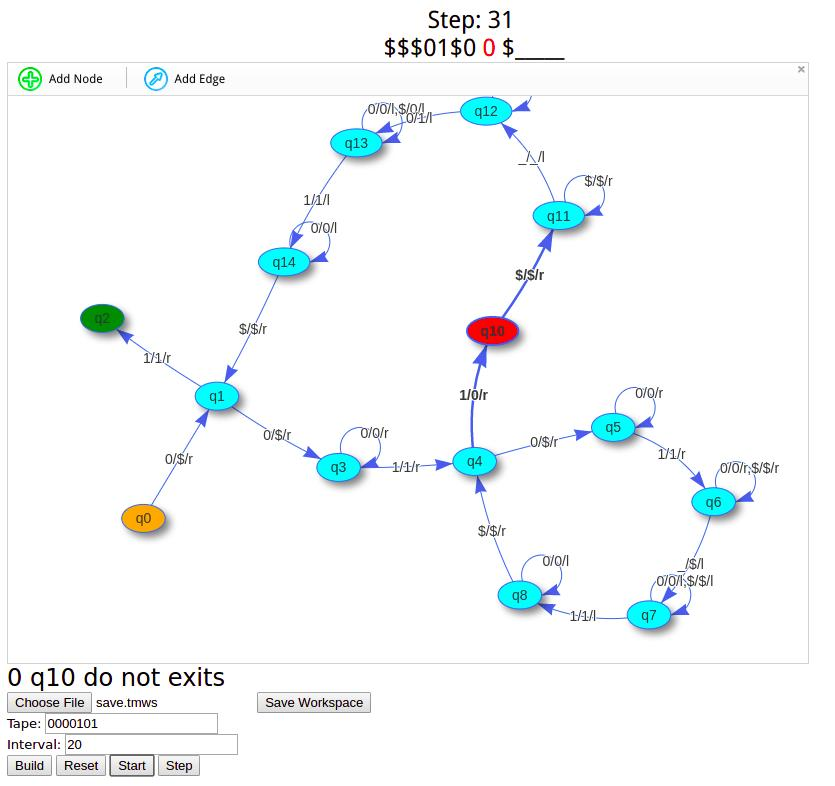
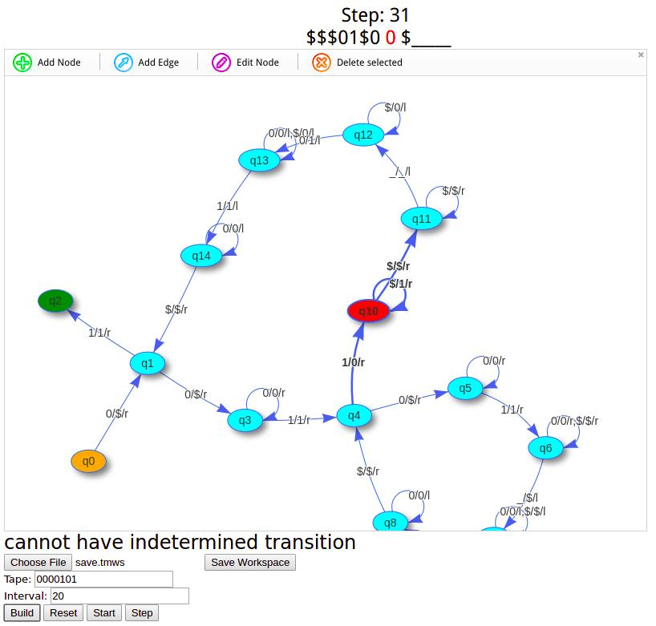
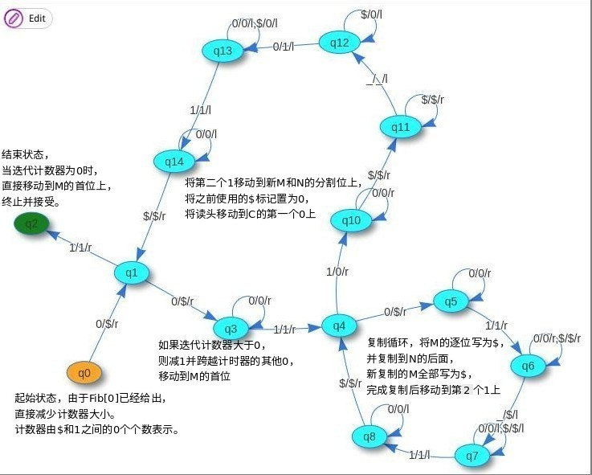
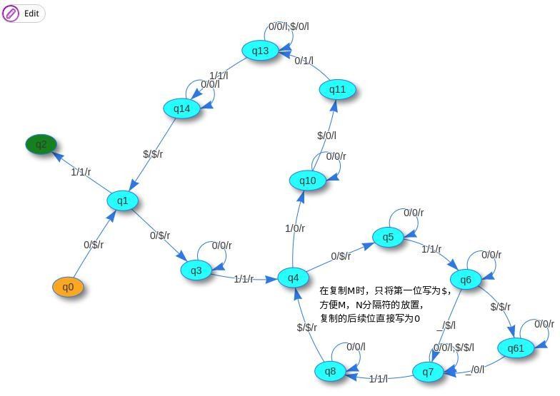
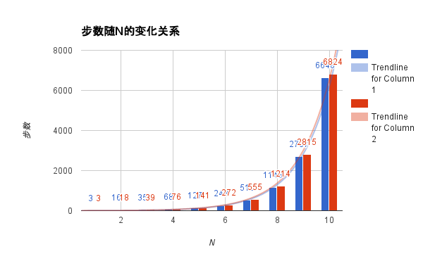

# 简介
## 问题
题目：输出斐波拉契数列的图灵机。

要求：设计图灵机，输入n，然后输出斐波拉契数列的第n项。
(需要有图形界面和测试例子)

## 功能
- 图形化的通用图灵机编辑器。
- 半无限带图灵机模拟器，以及可视化调试环境。
- 使用上述环境实现题目要求的图灵机，并进行了局部性能优化。

## 开发说明
本次作业使用Web技术开发，其中vis图形库用于图灵机的设计与调试可视化，npm包管理，grunt用于工作流控制。
项目目录如下：
```
$ tree . -L 1
.
├── build                   // Javascript文件中间结果存放
│   └── bundle.js
├── Gruntfile.js            // 定义Grunt自动化任务，如Browserify，Uglyfy
├── node_modules            // 使用npm install安装得到的依赖包
├── package.json            // 描述项目依赖等信息
├── public                  // Web根目录
│   ├── bundle.min.js       // 打包、代码混淆后的源文件
│   ├── bundle.min.js.map   // 调试信息
│   ├── img
│   ├── index.html          // Html布局文件
│   └── vis.min.css         // vis图形库所需的层叠式样式表文件
├── readme.md
├── src                     // 程序逻辑源文件夹
│   ├── app.js              // 主程序
│   ├── turing.js           // 图灵机编译与模拟器
│   └── util.js             // 工具函数
└── tmws                    // 序列化的图灵机文件

```
- 依赖包安装：`npm install`
- 编译、打包源文件：`grunt`
- 启动服务器：`cd public && python3 -m http.server`

# 使用说明

- 最简单的图灵机（读0写1,读1个1便接受）的设计、运行与调试，见视频Demo-1。
- 斐波拉契数列图灵机的读取、运行，见视频Demo-2，输入输出格式见图灵机设计描述。
- 在线Demo，[地址](http://security-administrator-alfred-48418.bitballoon.com/)。
斐波拉契数列图灵机的文件见twms文件夹。

从视频Demo中可以轻松地看出图灵机的图形化设计、保存装载、编译重置、运行调试过程，
如下两张图展示了图灵机编译与运行过程中出现的错误提示。



# 图灵机设计

## 输入输出格式
工作区示意：`<迭代次数计数器 C >1<当前计算的Fib数 M >1<上一次迭代计算的Fib数 N >`


输入格式： `0{n}101`

输入样例：
- n=1: `0101`
- n=3: `000101`
- n=5: `00000101`

在上述样例中，从首位开始的连续的`0`的个数描述了n，后面紧跟的`1`是分割符号，
再后面一个`0`表示1，这是由于斐波那契数列的第一位数为1，再后面跟着一个`1`作为分割符。

输出格式： 读头指向连续0的个数为所求的第n位斐波那契数列的值，`0{fib(n)}10{fib(n-1)}`。

输出样例：
- n=1: `$1[读头>]01`
- n=3: `$$$1[读头>]0010`
- n=5: `$$$$$1[读头>]000001000`

## 计算思路
- 单次迭代过程：将M复制一份到N后的空白区域，然后将M和N的分隔符移动到新复制的M的前一格。目的是计算将M+N赋予M，M赋予N。
- 迭代控制：若C不为0,则将C的计数器减1，然后执行上述迭代操作，并回到起始位置；否则移动读头到M的位置。
- 复制控制：逐个Bit将M复制到N后的空白区域。

## 转换图表示




## 局部优化与效果

观察上述图灵机，一个性能优化点在于在复制M的时候，新复制的M可以不全部写为$，再后期写为0，而可以改为将第一位标记为$，而后面的位都直接复制为0。这样后期就可以省去再将新N全部改写为0的操作了，而第一位标记为$是为了方便在新M和N之间放置分界符1。改动如下图所示：



针对如上的性能优化点，收集两个图灵机的步数随N的变化数据，结果如下：


可以看出，虽然第二个图灵机总是比第一个图灵机步数少，但性能的提升占总步数的比例却非常低，步数随着N呈指数级别上升，而优化的步数只呈现线性增长。

# 工程实现

## 使用Vis实现图绘制与操作
[Vis.js](http://visjs.org/index.html)是一个基于浏览器的动态Javascript可视化库，其中封装好了高度可定制化、可视化的网络模块。为了实现图灵机的动态编辑，我基于Visjs开源的[示例程序](http://visjs.org/examples/network/other/manipulation.html)，加入了图灵机设计中需要的元素，以方便用户通过可视化的界面创建图灵机。

图灵机的绘制与操作逻辑主要位于`src/app.js`中，主要描述以下功能：

### 创建图灵机设计绘图区
程序界面由`index.html`描述，主要分为两部分。网络编辑与可视化区域由id为`mynetwork`的网络绘图区，和id为`network-popUp`的网络信息编辑窗口构成。

控制面板由编译与调试信息，网络保存与载入控件，条带编辑区域和图灵机运行控制控件组成。在`document.body.onload`方法中可以看到对应控件的事件回调函数。


### 定义图中点和边的对应操作
`createNetwork`函数生成网络中初始的两个实例节点，并在`mynetwork`创建网络实例。其中的`options`参数描述了适用于图灵机的网络配置信息。
`options.layout`定义了网络的点和边的布局，物理效果（点排斥，边吸引）可以更好地设计图灵机中的状态和转换。
`options.manipulation`定义了网络中的六个基本事件的响应，点、边的增删改。对于点和边的增改，我们都给用户弹出信息编辑界面，并将数据保存在响应的点或是边中。对于新创建的点和边，赋予初始值。对于特殊的点和边，比如开始状态和结束状态，相应地修改点的特性以方便用户查看。

### 保存与载入
使用`saveWorkspace`函数将网络信息以JSON格式保存在文件中。
使用`restoreWorkspace`函数将用户选择的文件中的JSON信息重新解析为网络信息，并使用该网络信息创建网络，刷新界面。

## 图灵机的编译
图灵机的相关逻辑编写在`src/turing.js`模块中，对外暴露图灵机的主要数据结构以及图灵机的控制函数，同时需要提供信息输出接口，对网络中元素的高亮操作接口以及网络绘制回调。

图灵机数据结构中保存有如下信息：图灵机转换表，起始状态，读头位置，当前步数，当前状态，输入条带以及其他控制信息。

图灵机的编译函数为`turing.makeTable`。通过图的遍历，将图形化的图灵机翻译为图灵机状态转换表。状态转换表是一个二维映射表。第一层映射为状态到该状态的所有转换的映射；第二层映射为输入字符到某状态的其中一个转换的映射。

通过`reset`，完成图灵机运行前信息的初始化。

## 图灵机的运行与调试
图灵机的运行函数为`start`，单步调试函数为`step`，其中运行函数不断调用单步函数，每一步的时间间隔可调。

单步函数每次以当前状态，当前读头下的字符作为输入，在图灵机转换边中，通过两层映射找到对应的转换，并按照转换中的下一个状态、下一个字符和读头移动方向更新图灵机状态信息，在信息更新后，调用高亮函数在图灵机的可视化界面上提示当前图灵机的运行状态，并调用绘图回调刷新用户界面；如果未找到，则停机并输出调试信息；如果图灵机下一步没有转换并且当前状态可以接受，那么图灵机成功停机并输出信息。
